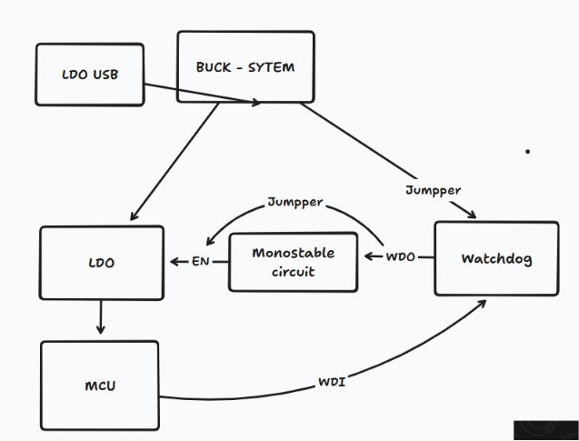

# Feather SAMD21 MAX637X Watchdog dev board

## Overview
This PCB is designed as a Feather-compatible replacement for the Adafruit Feather M0 Express based on the ATSAMD21G18A along with watchdog
MCU-WD architecture is as such:

   
  <em>High-level architecture of the Feather SAMD21 Watchdog board.</em>

The board retains the original Feather footprint, dimensions and pinout while integrating additional hardware including a MAX637x watchdog, USB Type-C interface, battery charging circuitry, USB protection, and other commonly used peripherals.

## Features
- ATSAMD21G18A MCU
- Feather-compatible footprint and pinout
- MAX637x pin set hardware watchdog
- 555 monostable multivibrator that helps in power cycling
- MCP73832 battery charging
- USB ESD protection
- USB Type-C interface
- 32.786Mhz External crystal oscillator
- multiple jumpers to bypass/cutoff certain circuits
- Reset button

## Applications
- Drop-in replacement for the Adafruit Feather M0 Express for 1U main PCB
- Feather-compatible embedded development
- CubeSat and avionics prototyping

## Notes
Designed and developed as part of **Team Anant**.
