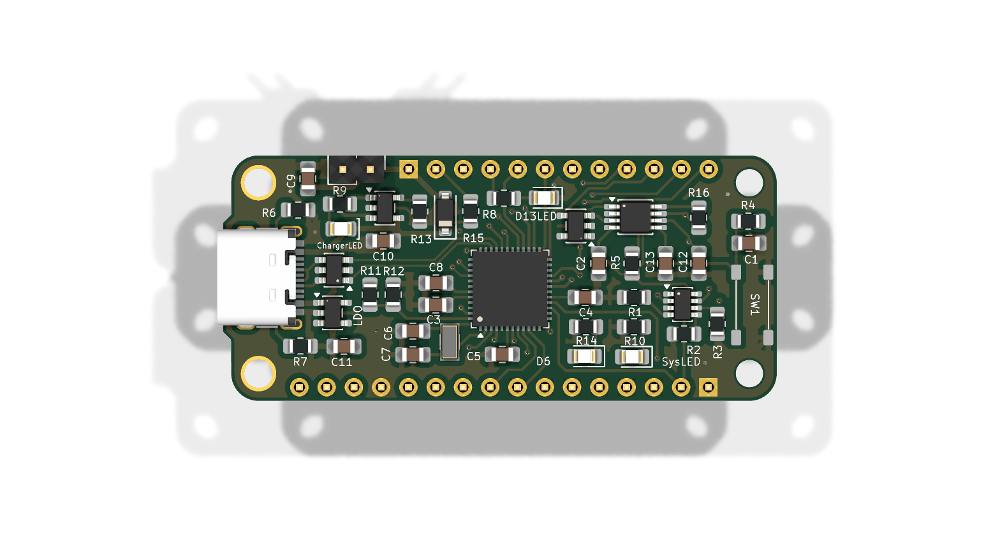
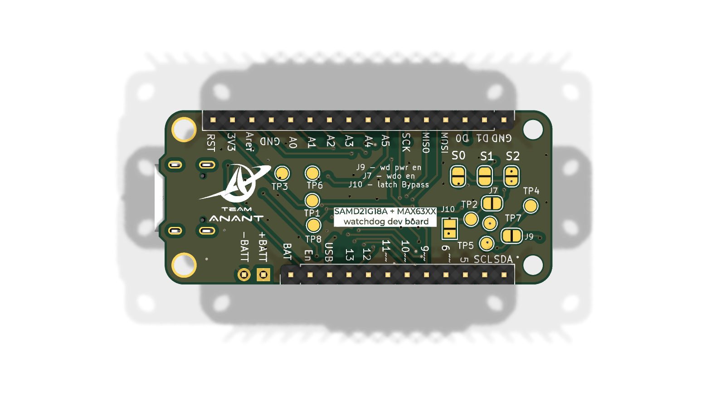

# Feather SAMD21 MAX637X Watchdog dev board

A Feather-compatible development board based on the ATSAMD21G18A microcontroller with an integrated MAX6373 hardware watchdog for improving system reliability. The board retains the Adafruit Feather M0 Express footprint and pinout while incorporating USB Type-C connectivity, Li-Po battery charging, USB protection, and external clock circuitry. A 555 monostable circuit enables MCU power cycling, while multiple jumper options allow sections of the watchdog and reset circuitry to be enabled, disabled, or bypassed as required.

### Board at a glance

| Category | Hardware |
|----------|----------|
| MCU | ATSAMD21G18A |
| Hardware Watchdog | MAX6373 |
| USB | USB Type-C with USBLC6-2SC6 ESD protection |
| Battery Charging | MCP73832 |
| Voltage Regulation | AP2112K-3.3 (×2), LM5155xMM |
| Clock | 32.768 kHz crystal oscillator |
| Power Cycling | 555 monostable circuit |
| Expansion | Feather-compatible headers |

## MCU-WD Architecture

   
  <em>High-level architecture of the Feather SAMD21 Watchdog board.</em>

## Schematic

## PCB

  
  

## Key Components

| Reference | Part | Function |
|----------|------|----------|
| U3 | ATSAMD21G18A-MU | Main microcontroller |
| U8 | MAX6373 | Hardware watchdog supervisor |
| U5 | MCP73832 | Li-Po battery charger |
| U2 | USBLC6-2SC6 | USB ESD protection |
| U4, U6 | AP2112K-3.3 | 3.3 V regulators |
| U7 | LM5155xMM | Power regulation |
| X1 | 32.768 kHz Crystal | External RTC clock source |
| D3 | BAT43W | Schottky diode |
| D2 | LED | Status indication |

## Connectors & I/O

| Reference | Interface | Description |
|----------|-----------|-------------|
| J1 | JumperSET0 | Watchdog configuration |
| J2 | JumperSET1 | Watchdog configuration |
| J3 | JumperSET2 | Watchdog configuration |
| J4 | Left Feather Header | Feather-compatible expansion |
| J5 | Right Feather Header | Feather-compatible expansion |
| J6 | Battery Header | Li-Po battery connection |
| J7 | Reset Enable Jumper | Enable/disable reset path |
| J8 | USB Type-C | USB interface |
| J9 | WD_PWR Jumper | Watchdog power control |
| J10 | Monostable Bypass Jumper | Bypass 555 power-cycle circuit |

Designed and developed as part of **Team Anant**.
